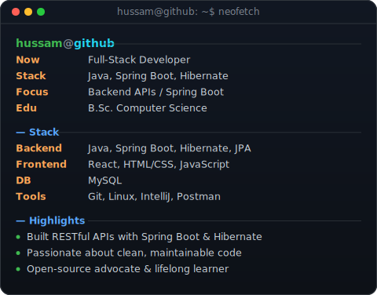

<table>
<tr>
<td valign="top"></td>
<td valign="top"></td>
</tr>
</table>

## Hussam Tarteer

**Full-Stack Software Engineer | Java | Spring Boot | Hibernate | ReactJS**

 

<!-- animated contribution graph, refreshed daily by the workflow -->

